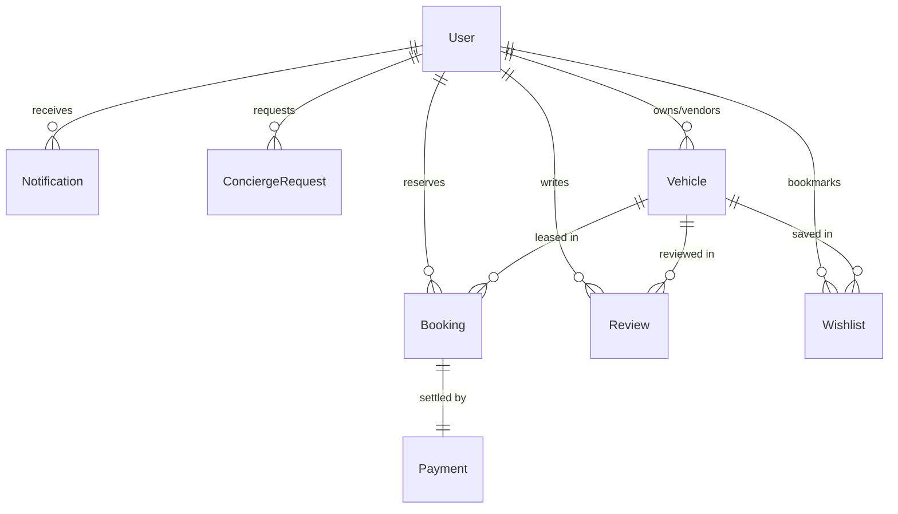

<div align="center">

# LUXORIA™
### Enterprise-Grade Ultra-Luxury Mobility & Fleet Orchestration Platform

[](https://github.com/Aaryan-9784/Luxoria)
[](#-security-architecture--compliance)
[](https://react.dev)
[](https://nodejs.org)
[](https://mongodb.com)
[](https://razorpay.com)
[](LICENSE)

<br />


<br />

**A mission-critical B2C & B2B luxury mobility ecosystem designed for elite concierge services, high-end fleet concessionaires, and ultra-high-net-worth clientele.**

[Executive Summary](#-executive-summary) · [System Topology](#-system-topology) · [Enterprise Portals](#-enterprise-portals) · [Security & Compliance](#-security-architecture--compliance) · [API Specification](#-rest-api-specification) · [Production Runbook](#-production-deployment--runbooks)

---

</div>

## 📋 Table of Contents

- [🏢 Executive Summary](#-executive-summary)
- [🏛️ System Topology & Architecture](#️-system-topology--architecture)
- [✨ Core Commercial Capabilities](#-core-commercial-capabilities)
- [🖥️ Enterprise Portals & User Journeys](#️-enterprise-portals--user-journeys)
- [🛡️ Role-Based Access Control (RBAC) Matrix](#️-role-based-access-control-rbac-matrix)
- [🗄️ Domain Entity Architecture & Data Model](#️-domain-entity-architecture--data-model)
- [🔐 Security Architecture & Compliance](#-security-architecture--compliance)
- [💳 Financial Settlement & Refund Lifecycle](#-financial-settlement--refund-lifecycle)
- [🛠️ Engineering Stack & Component Specifications](#️-engineering-stack--component-specifications)
- [📂 Monorepo File System Layout](#-monorepo-file-system-layout)
- [🚀 Local Development & Environment Setup](#-local-development--environment-setup)
- [🔑 Environment Variables Reference](#-environment-variables-reference)
- [📡 REST API Specification](#-rest-api-specification)
- [🚢 Production Deployment & Runbooks](#-production-deployment--runbooks)
- [📈 Performance, Observability & Auditing](#-performance-observability--auditing)
- [⚖️ Corporate Governance, Legal & Licensing](#️-corporate-governance-legal--licensing)

---

## 🏢 Executive Summary

**LUXORIA™** is a full-lifecycle digital automotive marketplace engineered specifically for the luxury and exotic mobility sector. Unlike commoditized vehicle rental scripts, Luxoria was conceptualized from first principles to reflect the discreet operational needs, high ticket sizes, and stringent verification standards demanded by luxury vehicle fleet owners, corporate travel bureaus, and high-net-worth individuals (HNWIs).

### Strategic Value Matrix

```
┌──────────────────────────────────────────────────────────────────────────────┐
│                            LUXORIA BUSINESS VALUE                            │
├───────────────────────┬──────────────────────────────┬───────────────────────┤
│    FOR CLIENTS        │       FOR FLEET OWNERS       │   FOR PLATFORM OPS    │
├───────────────────────┼──────────────────────────────┼───────────────────────┤
│ • Instant access to   │ • Comprehensive fleet        │ • Centralized dealer  │
│   verified supercars  │   utilization tracking       │   approval pipeline   │
│ • White-glove         │ • Blackout calendar & rate   │ • Multi-aggregator    │
│   chauffeur services  │   management controls        │   revenue reporting   │
│ • Bank-grade checkout │ • Direct dispute resolution  │ • Full KYC & account  │
│   with instant receipt│   and customer oversight     │   governance tooling  │
└───────────────────────┴──────────────────────────────┴───────────────────────┘
```

> [!NOTE]
> The platform is built natively with modern JavaScript technologies (React 19, Vite 6, Node.js 18+ ESM, Express 4, and MongoDB Atlas), ensuring zero legacy overhead, minimal bundle sizes, and production deployment velocity.

---

## 🏛️ System Topology & Architecture

Luxoria implements a modern multi-tier cloud topology optimized for high availability, transactional integrity, and low-latency asset delivery.

```
                                [ CLIENT SURFACE ]
          ┌─────────────────────────────────────────────────────────────┐
          │  React 19 SPA (Vite 6) · Tailwind CSS 4 Design Tokens       │
          │  Redux Toolkit 2.x Store · Axios Interceptor Pipeline       │
          │  jsPDF Dynamic Generator · Recharts SVG Engine              │
          └──────────────────────────────┬──────────────────────────────┘
                                         │  HTTPS / WSS (JSON REST + SSE)
                                         ▼
                                [ EDGE ROUTING ]
          ┌─────────────────────────────────────────────────────────────┐
          │  Vercel Edge Network / Global Anycast DNS CDN               │
          │  SPA Route Rewrites · Gzip/Brotli Compression · TLS 1.3     │
          └──────────────────────────────┬──────────────────────────────┘
                                         │  Reverse Proxy / REST
                                         ▼
                                [ APPLICATION CORE ]
          ┌─────────────────────────────────────────────────────────────┐
          │  Express 4 Application Cluster (Node.js 18+ ESM)            │
          │                                                             │
          │  ┌──────────────────────┐   ┌────────────────────────────┐  │
          │  │ Security Perimeter   │   │ Business Logic Engine      │  │
          │  │ • Helmet Security    │   │ • Atomic Conflict Engine   │  │
          │  │ • HPP Parameter San. │   │ • Dynamic Pricing Pipeline │  │
          │  │ • Mongo Query Filter │   │ • 11 Aggregation Pipelines │  │
          │  │ • Dual JWT + OTP     │   │ • SSE Stream Broadcaster   │  │
          │  └──────────┬───────────┘   └─────────────┬──────────────┘  │
          └─────────────┼─────────────────────────────┼─────────────────┘
                        │                             │
        ┌───────────────┴──────────────┐              │
        ▼                              ▼              ▼
[ MEDIA INFRASTRUCTURE ]     [ PAYMENT GATEWAY ]   [ DATABASE CLUSTER ]
  Cloudinary v2 Global         Razorpay API         MongoDB Atlas
  Image CDN & Stream Buffers   HMAC-SHA256 Sig      Replica Set (Luxoria2)
```

---

## ✨ Core Commercial Capabilities

### 1. 🛡️ Bank-Grade Identity & Dual-Token Architecture
- **Dual JWT Security**: 15-minute cryptographically signed Access Tokens coupled with 7-day HTTP-Only, `SameSite=Strict` Refresh Tokens stored in secure cookie storage.
- **Atomic Refresh Token Rotation**: Implements active session theft detection—if a compromised refresh token is reused, all active sessions for that user account are automatically revoked.
- **2-Step Login Multi-Factor Authentication (MFA)**: Mandatory 6-digit email OTP for manual credentials, hashed via SHA-256 with strict 10-minute time-to-live (TTL) and brute-force backoff limits.
- **Google OAuth 2.0 Integration**: Frictionless one-click social authentication via Passport.js automatically synchronizing verified identity records.

### 2. ⚡ Zero-Collision Fleet Reservation Engine
- **Server-Side Conflict Interceptor**: Solves the concurrent booking problem by running atomic MongoDB date boundary overlap queries (`$and` / `$nor`) both during UI date selection and immediately before payment order generation.
- **Lifecycle Pipeline**: Explicit state transitions: `pending` $\rightarrow$ `confirmed` $\rightarrow$ `active` $\rightarrow$ `completed` (or `cancelled`).
- **Dynamic Price Breakdown Engine**: Computes duration, progressive multi-day rate reductions, security deposits, and value-added concierge charges server-side.

### 3. 💳 Razorpay Enterprise Payment Gateway
- **Tamper-Proof Order Initialization**: Prices are never accepted from client requests; the server computes exact amounts in currency sub-units (paise/cents) before requesting an order from Razorpay.
- **Cryptographic Signature Verification**: Payments are only confirmed upon mathematical verification of the `razorpay_signature` using HMAC-SHA256 hashing against the server secret key.
- **Automated Tiered Refund Engine**: Automatic refund calculations during customer cancellations based on contractual timelines (>48h: 100%, 24-48h: 50%, <24h: 0%).

### 4. 📊 Enterprise Real-Time Analytics Suite
- **Platform Executive Aggregations**: 11 concurrent MongoDB aggregation pipelines generating real-time KPIs: Gross Volume, Net Platform Fees, Fleet Utilization Rates, Customer Acquisition Trends, and Vendor Settlement Balances.
- **Fleet Concessionaire Analytics**: 5 focused pipelines providing individual vehicle profitability, rental day trends, and customer satisfaction ratings.

### 5. 🛎️ White-Glove Concierge & Chauffeur Services
- **Bespoke Mobility Requests**: Dedicated dispatch module enabling customers to book professional chauffeurs, airport VIP pickup, and personal security escorts alongside vehicle leases.

---

## 🖥️ Enterprise Portals & User Journeys

Luxoria segregates access into three distinct, branded application interfaces within a single unified web application:

### 1. 👤 Client Portal (*Storefront & Private Ledger*)
| Functional Domain | Enterprise Capabilities |
|:---|:---|
| **Fleet Discovery** | High-performance catalog browsing with category tabs, dynamic pricing sliders, mechanical spec sheets, and high-resolution photo galleries. |
| **Reservation Hub** | Interactive date-range calendar picker with real-time blackout checks and integrated Razorpay modal checkout. |
| **Customer Portfolio** | Centralized booking dashboard, real-time status tracking, cancellation requests, digital wallet transaction history, and instant PDF invoice downloads. |
| **Personal Profile** | Cloudinary-powered avatar upload, credential management, personal review administration, and notification settings. |

### 2. 🏢 Fleet Vendor Portal (*Concessionaire Command Center*)
| Functional Domain | Enterprise Capabilities |
|:---|:---|
| **Inventory Management** | Multi-step vehicle submission wizard supporting technical telemetry (horsepower, top speed, engine specs) and Cloudinary multi-image uploads. |
| **Reservation Ledger** | Real-time intake queue to review, approve, reject, or mark active vehicle handovers. |
| **Availability Scheduler** | Calendar-based blackout module for maintenance, private leases, or seasonal downtime. |
| **Financial Intelligence**| Detailed revenue breakdown, earnings statements, payout ledger, and utilization charts. |

### 3. 🛡️ Admin Governance Suite (*Platform Operations*)
| Functional Domain | Enterprise Capabilities |
|:---|:---|
| **Executive Dashboard** | Bird's-eye platform metrics: Gross booking volume, total active fleet units, daily registration velocity, and platform margins. |
| **Fleet Auditing Pipeline**| Compliance and safety audit pipeline to review, approve, or reject vendor vehicle submissions before public listing. |
| **Account Governance** | User and vendor account moderation, verification elevation, and security suspension toggles. |
| **Concierge Coordination**| Service queue for VIP doorstep delivery, private driver dispatch, and itinerary fulfillment. |

---

## 🛡️ Role-Based Access Control (RBAC) Matrix

Luxoria enforces strict RBAC at both the API layer (`protect`, `authorize`) and the client routing layer (`RoleRoute`, `ProtectedRoute`, `GuestRoute`).

```
                              [ INCOMING REQUEST ]
                                       │
                                       ▼
                             [ protect Middleware ]
                                       │
                ┌──────────────────────┴──────────────────────┐
                │ Valid JWT Access Token                      │ Missing / Expired
                ▼                                             ▼
       [ Populate req.user ]                         [ 401 Unauthorized ]
                │
                ▼
       [ authorize('role') ]
                │
    ┌───────────┴───────────┐
    │ Matches Allowed Role   │ Role Mismatch
    ▼                       ▼
[ Next Controller ]     [ 403 Forbidden ]
```

| Operational Capability | Public / Guest | Client (`user`) | Fleet Owner (`vendor`) | Platform Admin (`admin`) |
|:---|:---:|:---:|:---:|:---:|
| Browse Approved Fleet & Specs |  |  |  |  |
| Submit Inquiries & VIP Newsletter |  |  |  |  |
| Book Vehicle & Authorize Payment | ❌ |  | ❌ | ❌ |
| Manage Personal Bookings & Invoices | ❌ |  | ❌ |  |
| Write Reviews & Manage Wishlist | ❌ |  | ❌ |  |
| Submit Fleet Vehicles for Listing | ❌ | ❌ |  |  |
| Edit / Update Vendor Fleet | ❌ | ❌ |  |  |
| Access Vendor Revenue & Booking Ops | ❌ | ❌ |  | ❌ |
| Audit & Approve Fleet Submissions | ❌ | ❌ | ❌ |  |
| Suspend / Elevate User & Vendor Accounts | ❌ | ❌ | ❌ |  |
| View Platform Financial Aggregations | ❌ | ❌ | ❌ |  |
| Manage Platform Concierge Queue | ❌ | Submit | ❌ | Manage |

---

## 🗄️ Domain Entity Architecture & Data Model

The application operates on the **`Luxoria2`** production database in MongoDB Atlas, governed by 9 Mongoose schemas:



### Schema Inventory

| Entity | Mongoose Model | Primary Indexes | Key Responsibilities |
|:---|:---|:---|:---|
| **User** | `User.js` | `email`, `role`, `createdAt` | Account authentication, roles, OAuth identifiers, OTP hash & expiry, profile telemetry. |
| **Vehicle** | `Vehicle.js` | `slug`, `status`, `vendor`, `brand` | Fleet inventory, technical specifications, Cloudinary images, approval status, pricing. |
| **Booking** | `Booking.js` | `user`, `vehicle`, `startDate`, `endDate`, `status` | Rental reservations, double-booking prevention, total pricing, cancellation details. |
| **Payment** | `Payment.js` | `booking`, `razorpayOrderId`, `status` | Razorpay order IDs, payment IDs, HMAC signatures, refund audit records. |
| **Review** | `Review.js` | `vehicle`, `user`, `rating` | Customer reviews, ratings (1-5), and feedback for verified rentals. |
| **Wishlist** | `Wishlist.js` | `user`, `vehicle` | User vehicle bookmarks for quick access. |
| **Notification** | `Notification.js` | `recipient`, `isRead`, `createdAt` | Real-time system notifications and SSE streaming delivery. |
| **ConciergeRequest** | `ConciergeRequest.js` | `user`, `status`, `date` | Chauffeur, security, and white-glove doorstep delivery requests. |
| **Newsletter** | `Newsletter.js` | `email`, `isActive` | VIP marketing and launch update subscriptions. |

---

## 🔐 Security Architecture & Compliance

### 1. Dual-Token + 2-Step OTP Authentication Flow

```
[ User Enters Credentials ]
             │
             ▼
[ Verify Password with bcrypt (12 rounds) ] ──(Invalid)──▶ [ 401 Unauthorized ]
             │
          (Valid)
             ▼
[ Generate Cryptographic 6-Digit Code ]
[ Compute SHA-256 Hash & Persist with 10-min TTL ]
[ Dispatch Plain OTP via SMTP (Nodemailer) ]
             │
             ▼
[ Prompt OTP Verification Modal ]
             │
             ▼
[ Submit OTP ] ──▶ [ Verify SHA-256 Hash ] ──(Mismatch)──▶ [ 400 Invalid OTP ]
                          │
                       (Match)
                          ▼
            [ Generate 15m JWT Access Token ]
            [ Generate 7d JWT Refresh Token ]
            [ Set Secure HTTP-Only Cookie ]
            [ Return User Profile & Access Token ]
```

### 2. Defense-in-Depth Middleware Stack

```
[ INCOMING HTTP REQUEST ]
           │
           ▼
[ Helmet Middleware ]           Sets security headers (X-Frame-Options, HSTS, X-XSS-Protection)
           │
           ▼
[ CORS Origin Whitelist ]       Validates Origin against CLIENT_URL whitelist
           │
           ▼
[ Express Rate Limiter ]        Enforces window-based sliding limits (Auth: 5/15m, General: 100/15m)
           │
           ▼
[ Express Mongo Sanitize ]      Recursively strips '$' and '.' characters from body/params/query
           │
           ▼
[ HPP Parameter Sanitation ]    Eliminates HTTP Parameter Pollution attacks
           │
           ▼
[ Joi Validation Layer ]        Validates payload structure and data types before controllers
           │
           ▼
[ Route Controller Logic ]
```

---

## 💳 Financial Settlement & Refund Lifecycle

```
CLIENT APP                        BACKEND CORE                      RAZORPAY API
    │                                  │                                  │
    │ 1. POST /api/payments/create-order│                                  │
    │    { bookingId }                 │                                  │
    │ ───────────────────────────────> │ 2. Compute cost from Vehicle    │
    │                                  │    record & date math            │
    │                                  │ 3. Create Order in Sub-units     │
    │                                  │ ───────────────────────────────> │
    │                                  │ 4. Return { id: order_xxx }      │
    │                                  │ <─────────────────────────────── │
    │ 5. Return order payload          │                                  │
    │ <─────────────────────────────── │                                  │
    │                                  │                                  │
    │ 6. Open Razorpay Modal & Pay     │                                  │
    │ ──────────────────────────────────────────────────────────────────> │
    │ 7. Return Payment Signature      │                                  │
    │ <────────────────────────────────────────────────────────────────── │
    │                                  │                                  │
    │ 8. POST /api/payments/verify     │                                  │
    │    { orderId, paymentId, sig }   │                                  │
    │ ───────────────────────────────> │ 9. Compute HMAC-SHA256           │
    │                                  │    Crypto verification           │
    │                                  │ 10. Update Booking & Payment     │
    │ 11. Return Success & Receipt     │                                  │
    │ <─────────────────────────────── │                                  │
```

### Contractual Refund Matrix
| Cancellation Horizon | Refund Tier | Implementation Details |
|:---|:---:|:---|
| **> 48 hours** prior to rental start | **100% Full Refund** | Automated Razorpay refund transaction; payment status marked `refunded`. |
| **24 to 48 hours** prior to rental start | **50% Partial Refund** | 50% retained as platform holding fee; balance refunded via Razorpay. |
| **< 24 hours** prior to rental start | **0% Non-Refundable** | Immediate forfeiture due to fleet blackout reserve costs. |

---

## 🛠️ Engineering Stack & Component Specifications

### Frontend Layer
- **Framework**: [React 19](https://react.dev/) — Functional components with Hooks, Suspense, and Lazy Loading.
- **Build Engine**: [Vite 6](https://vitejs.dev/) — Lightning-fast ES modules development and Rollup production bundling.
- **Styling Architecture**: [Tailwind CSS 4](https://tailwindcss.com/) — High-contrast luxury design tokens, CSS variables, and bespoke scrollbars.
- **Animation System**: [Framer Motion 11](https://www.framer.com/motion/) — Hardware-accelerated transitions, modal physics, and card hover effects.
- **Analytics Visualization**: [Recharts 3](https://recharts.org/) — Scalable SVG charts with dynamic tooltips and responsive containers.
- **State Store**: [Redux Toolkit 2](https://redux-toolkit.js.org/) — Normalized state slices with async thunks for predictable state management.

### Backend Layer
- **Runtime**: [Node.js 18+ (ESM)](https://nodejs.org/) — Native ECMAScript Modules for clean modular imports.
- **Web Framework**: [Express 4](https://expressjs.com/) — Enterprise middleware chaining, routing controllers, and centralized error catching.
- **Database / ORM**: [MongoDB Atlas](https://www.mongodb.com/atlas) with [Mongoose 8](https://mongoosejs.com/) — Strict schema types, automated validators, and document middleware.
- **Cryptographic Security**: `crypto`, `bcryptjs`, and `jsonwebtoken` — Standardized AES/HMAC hashing and JWT signing.
- **Media Ingestion**: [Cloudinary v2](https://cloudinary.com/) + [Multer](https://github.com/expressjs/multer) + [Streamifier](https://github.com/gabrielflorit/streamifier) — Zero-disk-write memory buffer stream uploads.

---

## 📂 Monorepo File System Layout

```
LUXORIA/
├── .gitignore                         # Enterprise root exclusions (Secrets, Caches, OS files)
├── README.md                          # Master architectural documentation
│
├── backend/                           # API Server Application
│   ├── .env.example                   # Backend environment template
│   ├── .gitignore                     # Backend-specific exclusions
│   ├── package.json                   # Backend dependencies & script definitions
│   ├── render.yaml                    # Infrastructure blueprint for Render Web Services
│   │
│   └── src/
│       ├── app.js                     # Express app setup, CORS, Helmet, RateLimiting, Router
│       ├── server.js                  # Process bootstrapping, DB connection & port binding
│       │
│       ├── config/                    # Infrastructure & vendor initializations
│       │   ├── db.js                  #   Mongoose connection pool configuration
│       │   ├── cloudinary.js          #   Cloudinary API credentials
│       │   ├── mail.js                #   Nodemailer SMTP transport
│       │   ├── passport.js            #   Google OAuth 2.0 passport strategy
│       │   └── razorpay.js            #   Razorpay instance setup
│       │
│       ├── constants/                 # Domain constants, enums & limits
│       │   └── index.js
│       │
│       ├── controllers/               # Business logic & request handling
│       │   ├── adminController.js     #   User/vendor auditing & platform analytics
│       │   ├── authController.js      #   Registration, login, OTP & session rotation
│       │   ├── bookingController.js   #   Collision prevention & booking lifecycle
│       │   ├── contactController.js   #   Inquiry dispatch & support ticket routing
│       │   ├── newsletterController.js#   Newsletter marketing subscriptions
│       │   ├── notificationController.js# Notification CRUD & SSE stream broadcast
│       │   ├── paymentController.js   #   Razorpay order creation & signature verification
│       │   ├── reviewController.js    #   Verified rental rating management
│       │   ├── userController.js      #   Profile updates, avatar & password changes
│       │   ├── vehicleController.js   #   Fleet specifications, search & image upload
│       │   └── wishlistController.js  #   Wishlist toggle & management
│       │
│       ├── middleware/                # Express middleware suite
│       │   ├── auth.js                #   JWT verification & RBAC authorization
│       │   ├── errorHandler.js        #   Centralized ApiError response formatter
│       │   ├── rateLimiter.js         #   Sliding-window IP rate limiters
│       │   ├── upload.js              #   Multer in-memory file buffer handler
│       │   └── validate.js            #   Joi schema validation interceptor
│       │
│       ├── models/                    # Mongoose database models
│       │   ├── Booking.js             #   Rental reservations & collision intervals
│       │   ├── ConciergeRequest.js    #   VIP chauffeur and delivery orders
│       │   ├── Newsletter.js          #   VIP newsletter subscriptions
│       │   ├── Notification.js        #   In-app alerts & SSE event models
│       │   ├── Payment.js             #   Transaction logs & refund audits
│       │   ├── Review.js              #   Vehicle ratings and customer feedback
│       │   ├── User.js                #   Identity records, credentials & RBAC roles
│       │   ├── Vehicle.js             #   Fleet catalog & Cloudinary media links
│       │   └── Wishlist.js            #   Saved customer vehicle bookmarks
│       │
│       ├── routes/                    # API route definitions
│       │   ├── adminRoutes.js
│       │   ├── authRoutes.js
│       │   ├── bookingRoutes.js
│       │   ├── contactRoutes.js
│       │   ├── newsletterRoutes.js
│       │   ├── notificationRoutes.js
│       │   ├── paymentRoutes.js
│       │   ├── reviewRoutes.js
│       │   ├── userRoutes.js
│       │   └── vehicleRoutes.js
│       │
│       ├── services/                  # Business service implementations
│       │   ├── analyticsService.js    #   11-Pipeline MongoDB aggregations
│       │   ├── authService.js         #   Cryptographic OTP generation
│       │   ├── emailService.js        #   Branded HTML mail templates
│       │   ├── paymentService.js      #   Razorpay order & refund logic
│       │   └── uploadService.js       #   Cloudinary stream buffer pipeline
│       │
│       ├── utils/                     # Shared helpers & wrappers
│       │   ├── ApiError.js            #   Standard operational error abstraction
│       │   ├── ApiResponse.js         #   Consistent JSON envelope formatter
│       │   ├── apiFeatures.js         #   Query filtering, search & pagination
│       │   └── currency.js            #   Price and currency formatting utilities
│       │
│       └── validations/               # Joi request schema definitions
│           ├── authValidation.js
│           ├── bookingValidation.js
│           ├── paymentValidation.js
│           ├── userValidation.js
│           └── vehicleValidation.js
│
└── frontend/                          # Vite 6 + React 19 Client
    ├── .env.example                   # Client environment template
    ├── .gitignore                     # Frontend-specific exclusions
    ├── index.html                     # HTML5 shell with luxury typography
    ├── package.json                   # Client dependencies & scripts
    ├── vercel.json                    # Vercel SPA routing redirects
    ├── vite.config.js                 # Vite bundler, chunks & proxy config
    │
    └── src/
        ├── App.jsx                    # Root application component
        ├── main.jsx                   # React 19 bootstrap entry
        │
        ├── app/                       # Redux Toolkit store definition
        │   └── store.js
        │
        ├── components/                # Reusable UI component library
        │   ├── auth/                  #   OTP modal, OAuth button, login forms
        │   ├── common/                #   Navbar, Footer, Modals, Spinners
        │   └── ui/                    #   Buttons, Badges, Inputs, Dialogs
        │
        ├── layouts/                   # Layout scaffolds
        │   ├── AdminDashboardLayout.jsx
        │   ├── DashboardLayout.jsx    #   Client user portal layout
        │   ├── MainLayout.jsx         #   Public storefront layout
        │   └── VendorDashboardLayout.jsx
        │
        ├── pages/                     # Routed page views
        │   ├── admin/                 #   Admin dashboard, user audit, fleet audit
        │   ├── public/                #   Home, About, Contact, Collections, Auth
        │   │   ├── NotFoundPage.jsx   #   Bespoke luxury 404 handler
        │   │   └── UnauthorizedPage.jsx#  Access denied 403 handler
        │   ├── user/                  #   User dashboard, bookings, payments, profile
        │   ├── vehicles/              #   Vehicle catalog, details, booking checkout
        │   └── vendor/                #   Vendor dashboard, fleet wizard, availability
        │
        ├── redux/                     # Redux slices
        │   └── slices/
        │       ├── adminSlice.js
        │       ├── authSlice.js
        │       ├── bookingSlice.js
        │       ├── dashboardSlice.js
        │       ├── notificationSlice.js
        │       ├── reviewSlice.js
        │       ├── uiSlice.js
        │       ├── vehicleSlice.js
        │       └── vendorSlice.js
        │
        ├── routes/                    # Client route definitions & guards
        │   ├── AppRoutes.jsx          #   Lazy-loaded route mapping
        │   ├── GuestRoute.jsx         #   Guest-only route guard
        │   ├── ProtectedRoute.jsx     #   Authenticated user guard
        │   └── RoleRoute.jsx          #   RBAC authorization guard
        │
        ├── sections/                  # Modular landing page sections
        ├── services/                  # Axios HTTP client with auto-refresh
        └── styles/                    # Global Tailwind CSS tokens
```

---

## 🚀 Local Development & Environment Setup

### Prerequisites
- **Node.js**: `v18.0.0` or higher
- **npm**: `v9.0.0` or higher
- **MongoDB Atlas**: An active connection string
- **External API Keys**: Razorpay (Test mode), Cloudinary, Nodemailer SMTP credentials

### Step-by-Step Installation

#### 1. Repository Ingestion
```bash
git clone https://github.com/Aaryan-9784/Luxoria.git
cd Luxoria
```

#### 2. Environment Configuration
Duplicate the provided example templates:
```bash
# Setup backend configuration
cp backend/.env.example backend/.env

# Setup frontend configuration
cp frontend/.env.example frontend/.env
```
*(Populate the variables with your sandbox/test credentials—see [Environment Variables Reference](#-environment-variables-reference)).*

#### 3. Dependency Installation
```bash
# Install backend dependencies
cd backend
npm install

# Install frontend dependencies
cd ../frontend
npm install
```

#### 4. Launch Local Development Services
Execute both services in dedicated terminal instances:

```bash
# Terminal 1: Backend Express Server
cd backend
npm run dev
# Expected Output: ✓ MongoDB connected: ac-my2u6p0-shard...
# Server running at: http://localhost:5000
```

```bash
# Terminal 2: Frontend Vite Server
cd frontend
npm run dev
# Expected Output: VITE v6.x ready in XXX ms
# Client accessible at: http://localhost:5173
```

---

## 🔑 Environment Variables Reference

### Backend Configuration (`backend/.env`)

| Variable | Type | Required | Description | Example / Default |
|:---|:---:|:---:|:---|:---|
| `PORT` | Number | Optional | Express server binding port | `5000` |
| `NODE_ENV` | String | Required | Environment mode (`development` / `production`) | `development` |
| `CLIENT_URL` | String | Required | Allowed CORS origin for client requests | `http://localhost:5173` |
| `MONGODB_URI` | String | Required | MongoDB Atlas replica set URI targeting `Luxoria2` | `mongodb://...:27017/Luxoria2?ssl=true...` |
| `JWT_ACCESS_SECRET` | String | Required | Cryptographic secret for signing access tokens (min 32 chars) | `32+ character random string` |
| `JWT_REFRESH_SECRET`| String | Required | Cryptographic secret for signing refresh tokens (min 32 chars)| `32+ character random string` |
| `JWT_ACCESS_EXPIRES_IN` | String | Optional | Lifetime duration for access tokens | `15m` |
| `JWT_REFRESH_EXPIRES_IN`| String | Optional | Lifetime duration for refresh tokens | `7d` |
| `RAZORPAY_KEY_ID` | String | Required | Razorpay public key ID | `rzp_test_...` |
| `RAZORPAY_KEY_SECRET` | String | Required | Razorpay private secret for HMAC signatures | `your_secret_key` |
| `CLOUDINARY_CLOUD_NAME` | String | Required | Cloudinary organization name | `your_cloud_name` |
| `CLOUDINARY_API_KEY` | String | Required | Cloudinary API access key | `your_api_key` |
| `CLOUDINARY_API_SECRET` | String | Required | Cloudinary API secret | `your_api_secret` |
| `SMTP_HOST` | String | Required | SMTP host address | `smtp.gmail.com` |
| `SMTP_PORT` | Number | Required | SMTP TLS port | `587` |
| `SMTP_USER` | String | Required | SMTP authentication username / email | `your_email@gmail.com` |
| `SMTP_PASS` | String | Required | SMTP app password | `your_app_password` |
| `SMTP_FROM` | String | Required | Sender address for system emails | `noreply@luxoria.com` |
| `GOOGLE_CLIENT_ID` | String | Optional | Google OAuth 2.0 Web Client ID | `client_id.apps.googleusercontent.com` |
| `GOOGLE_CLIENT_SECRET` | String | Optional | Google OAuth 2.0 Client Secret | `client_secret` |
| `GOOGLE_CALLBACK_URL` | String | Optional | Google OAuth redirection callback | `http://localhost:5000/api/auth/google/callback` |

### Frontend Configuration (`frontend/.env`)

| Variable | Type | Required | Description | Example / Default |
|:---|:---:|:---:|:---|:---|
| `VITE_API_URL` | String | Required | Fully qualified path to Backend API | `http://localhost:5000/api` |
| `VITE_RAZORPAY_KEY_ID` | String | Required | Razorpay public key for checkout modal | `rzp_test_...` |

---

## 📡 REST API Specification

**Base Production URL**: `https://<api-domain>/api`  
**Local Development URL**: `http://localhost:5000/api`

### 1. Authentication & Session Services (`/api/auth`)
| HTTP | Route Path | Access | Payload / Query | Functional Description |
|:---|:---|:---:|:---|:---|
| `POST` | `/register` | Public | `{ name, email, password, phone }` | Registers client profile and provisions account. |
| `POST` | `/login` | Public | `{ email, password }` | Validates credentials and sends 6-digit email OTP. |
| `POST` | `/vendor/login` | Public | `{ email, password }` | Vendor portal login with OTP verification. |
| `POST` | `/admin/login` | Public | `{ email, password }` | Admin governance login with OTP verification. |
| `POST` | `/verify-otp` | Public | `{ email, otp }` | Verifies SHA-256 OTP; sets refresh cookie & returns access token. |
| `POST` | `/resend-otp` | Public | `{ email }` | Dispatches new OTP code subject to rate limits. |
| `POST` | `/refresh` | Public | *(HTTP-only cookie)* | Rotates refresh token and returns new access token. |
| `POST` | `/forgot-password` | Public | `{ email }` | Generates reset token and dispatches recovery email. |
| `PUT` | `/reset-password/:token` | Public | `{ password }` | Resets password with cryptographic token. |
| `POST` | `/logout` | Public | *(HTTP-only cookie)* | Invalidates session and clears refresh cookie. |
| `GET` | `/me` | Protected | Bearer Token | Retrieves authenticated identity profile. |
| `GET` | `/google` | Public | None | Initiates Google OAuth 2.0 authentication flow. |
| `GET` | `/google/callback` | Public | Query params | OAuth callback; redirects with session token. |

### 2. Vehicle Fleet Ingestion & Search (`/api/vehicles`)
| HTTP | Route Path | Access | Payload / Query | Functional Description |
|:---|:---|:---:|:---|:---|
| `GET` | `/` | Public | `page, limit, brand, minPrice, maxPrice` | Paginated search across all approved fleet vehicles. |
| `GET` | `/featured` | Public | None | Retrieves curated flagship vehicles for showcase. |
| `GET` | `/vendor` | Vendor | None | Retrieves fleet units belonging to authenticated vendor. |
| `GET` | `/:id` | Public | Route parameter | Detailed vehicle specs, gallery, and rates. |
| `POST` | `/` | Vendor | Vehicle spec payload | Submits new vehicle listing for administrative review. |
| `PUT` | `/:id` | Vendor | Vehicle update payload | Modifies pricing, specs, or availability of vendor vehicle. |
| `DELETE`| `/:id` | Vendor | Route parameter | Retires vehicle listing from active catalog. |
| `POST` | `/:id/images` | Vendor | `multipart/form-data` | Direct memory stream upload of gallery photos to Cloudinary. |
| `DELETE`| `/:id/images/:imageId` | Vendor | Route parameters | Deletes specific photo asset from Cloudinary & vehicle document. |

### 3. Reservation & Booking Operations (`/api/bookings`)
| HTTP | Route Path | Access | Payload / Query | Functional Description |
|:---|:---|:---:|:---|:---|
| `GET` | `/` | Protected | `page, limit, status` | Retrieves user-scoped booking history. |
| `POST` | `/` | User | `{ vehicleId, startDate, endDate }` | Creates reservation with date collision check. |
| `GET` | `/my` | User | None | Retrieves personal rental portfolio. |
| `GET` | `/vendor` | Vendor | None | Retrieves booking requests for vendor's fleet. |
| `GET` | `/:id` | Protected | Route parameter | Fetches granular booking details and status. |
| `PUT` | `/:id/status` | Vendor/Admin| `{ status }` | Advances booking lifecycle (`confirmed`, `active`, `completed`). |
| `PUT` | `/:id/cancel` | User | `{ cancellationReason }` | Cancels booking and triggers contractual refund tier. |

### 4. Financial Clearing & Verification (`/api/payments`)
| HTTP | Route Path | Access | Payload / Query | Functional Description |
|:---|:---|:---:|:---|:---|
| `POST` | `/create-order` | User | `{ bookingId }` | Generates verified Razorpay order with server pricing. |
| `POST` | `/verify` | User | `{ orderId, paymentId, signature }` | Verifies HMAC-SHA256 signature and confirms booking. |
| `GET` | `/:bookingId` | Protected | Route parameter | Returns payment receipt and transaction history. |

### 5. Enterprise Governance (`/api/admin`)
| HTTP | Route Path | Access | Payload / Query | Functional Description |
|:---|:---|:---:|:---|:---|
| `GET` | `/users` | Admin | `page, limit, search` | Comprehensive account management directory. |
| `PUT` | `/users/:id/status` | Admin | `{ status: 'active' \| 'banned' }` | Suspends or reinstates user accounts. |
| `GET` | `/vendors` | Admin | None | Directory of registered fleet concessionaires. |
| `PUT` | `/vendors/:id/approve` | Admin | `{ status: 'approved' \| 'rejected' }` | Reviews and approves vendor onboarding. |
| `GET` | `/vehicles` | Admin | None | Platform-wide fleet listing for auditing. |
| `PUT` | `/vehicles/:id/approve`| Admin | `{ status: 'approved' \| 'rejected' }` | Approves vehicle for public marketplace listing. |
| `DELETE`| `/vehicles/:id` | Admin | Route parameter | Platform-wide administrative removal of vehicle. |
| `GET` | `/bookings` | Admin | None | Platform-wide master reservation ledger. |
| `GET` | `/analytics` | Admin | None | Executes 11-pipeline aggregation dashboard. |
| `GET` | `/concierge` | Admin | None | Queue of VIP delivery and chauffeur requests. |
| `PUT` | `/concierge/:id/status`| Admin | `{ status }` | Updates concierge dispatch state. |

---

## 🚢 Production Deployment & Runbooks

### Frontend Deployment Pipeline (Vercel Edge Network)
1. Link your GitHub repository directly to [Vercel](https://vercel.com).
2. Configure **Root Directory** as `frontend`.
3. Select **Vite** as the framework preset.
4. Supply Production Environment Variables:
   - `VITE_API_URL`: Your live backend API base URL (`https://api.luxoria.com/api`).
   - `VITE_RAZORPAY_KEY_ID`: Live Razorpay Key ID.
5. Deploy. The committed [frontend/vercel.json](file:///d:/Projects/Luxoria/frontend/vercel.json) automatically enforces single-page rewrite rules for client-side routing.

### Backend Deployment Pipeline (Render Web Services)
1. Link your GitHub repository to [Render](https://render.com) as a **Web Service**.
2. Specify **Root Directory** as `backend`.
3. Set **Runtime** to `Node`.
4. Define commands:
   - **Build Command**: `npm install`
   - **Start Command**: `npm start` (executes `node src/server.js`)
5. Populate all Production Secrets from `backend/.env`.
6. Ensure the live frontend domain is appended to `CLIENT_URL` to allow CORS requests.

---

## 📈 Performance, Observability & Auditing

### Frontend Build Optimization
The client application uses Vite 6 with custom chunk-splitting definitions to ensure fast initial page loads:
- **Core Vendor Chunk**: React 19, React DOM, Redux Toolkit (`vendor.js`)
- **Animation Chunk**: Framer Motion (`motion.js`)
- **Data Visualization Chunk**: Recharts, D3 Shape (`charts.js`)
- **Iconography Chunk**: Lucide React (`icons.js`)

```
✓ 2,734 modules transformed
dist/index.html                                 2.10 kB │ gzip:   0.75 kB
dist/assets/index-B_B_jZUm.css                216.13 kB │ gzip:  30.28 kB
dist/assets/HomePage-DTjmrgik.js               20.67 kB │ gzip:   5.65 kB
dist/assets/VehicleListPage-CeWOdrlK.js        42.52 kB │ gzip:  11.14 kB
dist/assets/VehicleDetailsPage-C7ABUkw6.js     27.43 kB │ gzip:   7.29 kB
dist/assets/vendor-D1fhGqJk.js                 83.80 kB │ gzip:  30.12 kB
dist/assets/motion-ObLjuJ-N.js                127.63 kB │ gzip:  42.94 kB
dist/assets/charts-COGjlqLp.js                335.69 kB │ gzip:  95.93 kB
dist/assets/index-mOL5PAkE.js                 381.26 kB │ gzip: 110.43 kB
✓ Built in 17.12s
```

### Health Check & Uptime Telemetry
- **Liveness & Readiness Probe**: `GET /api/health`
- **Expected Response**:
```json
{
  "success": true,
  "message": "LUXORIA API is running",
  "timestamp": "2026-09-13T17:25:01.297Z",
  "environment": "development"
}
```

---

## ⚖️ Corporate Governance, Legal & Licensing

### Open Source & Enterprise Licensing
This project is distributed under the **MIT License**. You are free to inspect, adapt, fork, and self-host the source code in accordance with the terms laid out in the `LICENSE` document.

### Contributions & Engineering Guidelines
We welcome contributions, security disclosures, and architectural feedback:
1. **Fork** the master branch.
2. Create your isolated feature branch (`git checkout -b feature/enterprise-enhancement`).
3. Commit structured changes with descriptive conventional commits (`git commit -m 'feat: implement webhook verification'`).
4. Push to your branch (`git push origin feature/enterprise-enhancement`).
5. Open an official Pull Request.

---

<div align="center">

### 🏛️ Engineering Leadership

**Aryan Patel** — Chief Architect & Full-Stack Lead

[](https://github.com/Aaryan-9784)
[](mailto:aaryanpatel9784@gmail.com)

<br />

**LUXORIA™ Premium Private Limited** · Corporate Head Office: Gujarat, India  
**Direct Concierge / Executive Contact**: [aaryanpatel9784@gmail.com](mailto:aaryanpatel9784@gmail.com) · +91 82380 12515

<br />

*© 2026 LUXORIA Premium Private Limited. All intellectual property, trademarks, and associated brand assets are reserved.*

</div>
